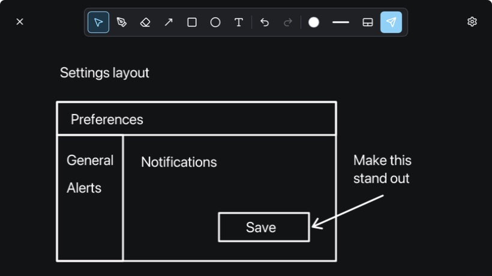

# Kaku2Okur

**English** | [日本語](README.ja.md)


**Sketch it. Send it.** A lightweight desktop utility for drawing a quick idea and pasting it into the app you were already using.

## In use



A settings layout sketched in the actual app, with an arrow showing the suggested change. [Screenshot details](docs/images/README.md).

## How it works

1. Focus an input that accepts images in your chat app, editor, or other application.
2. Press **left + right Option** on macOS, or **left + right Alt** on Windows.
3. Draw with the pen, arrows, rectangles, ellipses, eraser, and text tools.
4. Press **Enter** or **Send**. Kaku2Okur crops to the drawing's content, restores the previous app, and requests image paste.

Repeat the invocation gesture to temporarily hide the canvas, then invoke it again to resume the same sketch. Image acceptance depends on the destination app. If paste dispatch cannot be performed, the image remains on the clipboard for manual paste.

## Features

- **Type where you point.** Start typing on the canvas, including Japanese IME composition, to place text. Drag labels to reposition them.
- **Hold to Tidy.** Pause at the end of a pen stroke to turn a recognized line, rectangle, or ellipse into an editable geometric object.
- **Edit before sending.** Move, resize, delete, undo, and redo objects.
- **Personalize the canvas.** Light, dark, or custom backgrounds and a separate window position for each display.
- **Trackpad Sketch Mode (macOS beta).** Map a supported trackpad to the canvas, with eight configurable corner/edge hotspots for tools and actions.
- **Local and lightweight.** Rust, Slint software rendering, and tiny-skia. No embedded browser, JavaScript runtime, account, or cloud service is needed for the core workflow. Sketches are temporary, without a persistent drawing library.

### Keyboard controls

| Action | macOS | Windows |
| --- | --- | --- |
| Show / temporarily hide | Left + right Option | Left + right Alt |
| Send from the canvas | Enter | Enter |
| Finish text without sending | Command + Enter | Ctrl + Enter |
| Undo | Command + Z | Ctrl + Z |
| Redo | Command + Shift + Z / Command + Y | Ctrl + Shift + Z / Ctrl + Y |
| Delete selection | Delete / Backspace | Delete / Backspace |
| Cancel edit, clear selection, then discard | Escape | Escape |
| Discard and close | Command + W | Ctrl + W |

While editing text, Enter confirms IME conversion or inserts a line break; it does not send. **Done** or a click outside the editor also finishes text entry. Change the invocation gesture in Settings, including for keyboards without both modifier keys.

## Requirements

| Platform | Requirements |
| --- | --- |
| macOS | macOS 14+. Building requires **Rust 1.90+** and **full Xcode 26+**, including `actool` for the layered icon. Command Line Tools alone are not sufficient. |
| Windows | Rust 1.90+ **MSVC** toolchain; Visual Studio Build Tools with **Desktop development with C++** and a Windows SDK. |

macOS is the primary platform. The Windows implementation and build script are included, but this preparation was verified on Apple Silicon. Windows and Intel Mac execution still need device testing. Raw Trackpad Sketch Mode is macOS-only.

## Install the self-contained, unnotarized build

> [!IMPORTANT]
> These instructions are prepared for the first `yakitori-daisuki/Kaku2Okur` release. They will work after assets are published on [GitHub Releases](https://github.com/yakitori-daisuki/Kaku2Okur/releases).

The recipient needs only macOS's built-in tools, without Rust, Xcode, Homebrew, or an Apple Developer account.

### Install with one copy and paste

> [!WARNING]
> This installs a build without Developer ID signing or notarization. `--allow-unsigned` explicitly allows quarantine removal on the newly installed app. Run this only if you trust this repository.

Paste the entire block into Terminal. It detects your Mac's architecture, downloads the matching installer and SHA-256 file, and runs the installer only after verification succeeds.

```bash
/bin/bash -c '
set -euo pipefail
case "${1:-}" in
  --allow-unsigned|--verify-only) mode="$1" ;;
  *) echo "usage: $0 --allow-unsigned | --verify-only" >&2; exit 2 ;;
esac
[[ $# -eq 1 ]] || { echo "error: unexpected arguments" >&2; exit 2; }
[[ "$(uname -s)" == Darwin ]] || { echo "error: macOS is required" >&2; exit 1; }
arch="$(uname -m)"
case "$arch" in arm64|x86_64) ;; *) echo "error: unsupported architecture: $arch" >&2; exit 1 ;; esac
umask 077
base="https://github.com/yakitori-daisuki/Kaku2Okur/releases/latest/download"
name="Kaku2Okur-install-unsigned-$arch.sh"
temp_root="${TMPDIR:-/tmp}"
work="$(/usr/bin/mktemp -d "${temp_root%/}/kaku2okur-download.XXXXXX")"
cleanup() { /bin/rm -rf "$work"; }
trap cleanup EXIT
trap "exit 130" HUP INT TERM
cd "$work"
fetch() {
  /usr/bin/curl --disable --fail --silent --show-error --location \
    --max-redirs 10 --proto "=https" --proto-redir "=https" \
    --connect-timeout 20 --max-time 600 --retry 3 --output "$1" "$2"
}
fetch "$name" "$base/$name"
fetch "$name.sha256" "$base/$name.sha256"
read -r expected listed extra < "$name.sha256"
[[ -z "${extra:-}" && "$listed" == "$name" && ${#expected} -eq 64 && "$expected" != *[!0-9a-f]* ]] || { echo "error: invalid checksum manifest" >&2; exit 1; }
[[ "$(/usr/bin/awk "END { print NR }" "$name.sha256")" == "1" ]] || { echo "error: checksum manifest must contain exactly one line" >&2; exit 1; }
/usr/bin/shasum -a 256 -c "$name.sha256"
if [[ -d /Applications && -w /Applications ]]; then scope="--system"; else scope="--user"; fi
/bin/bash "$name" "$scope" "$mode"
' -- --allow-unsigned
```

The app goes into `/Applications` when writable, otherwise `~/Applications`. Temporary downloads are removed afterward. Quit Kaku2Okur before installing; the installer backs up any existing app.

The checksum comes from the same release. It detects corruption or mismatched files, but does not independently authenticate the publisher if the release account is compromised.

### Download and verify manually

| Mac | Installer | Checksum |
| --- | --- | --- |
| Apple Silicon | [arm64](https://github.com/yakitori-daisuki/Kaku2Okur/releases/latest/download/Kaku2Okur-install-unsigned-arm64.sh) | [SHA-256](https://github.com/yakitori-daisuki/Kaku2Okur/releases/latest/download/Kaku2Okur-install-unsigned-arm64.sh.sha256) |
| Intel | [x86_64](https://github.com/yakitori-daisuki/Kaku2Okur/releases/latest/download/Kaku2Okur-install-unsigned-x86_64.sh) | [SHA-256](https://github.com/yakitori-daisuki/Kaku2Okur/releases/latest/download/Kaku2Okur-install-unsigned-x86_64.sh.sha256) |

Each link becomes available after its architecture's assets are published. The first locally built and verified target is Apple Silicon. Save both files to the same folder. On Apple Silicon:

```bash
cd ~/Downloads
shasum -a 256 -c Kaku2Okur-install-unsigned-arm64.sh.sha256
```

Proceed only when the result is `OK`. Inspect the installer and run it:

```bash
less Kaku2Okur-install-unsigned-arm64.sh
bash Kaku2Okur-install-unsigned-arm64.sh --user --allow-unsigned
```

For Intel, replace `arm64` with `x86_64`. Use `--user` for `~/Applications`, `--system` for a writable `/Applications`, and `--no-open` to skip launching. `--verify-only` validates without installing.

## Build and run from source

```bash
git clone https://github.com/yakitori-daisuki/Kaku2Okur.git
cd Kaku2Okur
```

Use **Code → Download ZIP** to download and extract the source, or clone this repository with Git. Open a terminal in the repository root.

### macOS

Install [Rust](https://rustup.rs/) and full [Xcode](https://developer.apple.com/xcode/), and open Xcode once to complete setup. If `xcode-select -p` points to Command Line Tools or a different Xcode, select the full installation:

```bash
sudo xcode-select --switch /Applications/Xcode.app/Contents/Developer
```

Build and launch:

```bash
./script/build_and_run.sh
```

The first build downloads dependencies pinned in `Cargo.lock`. The script stops any running Kaku2Okur, builds the executable and icon, creates **`dist/Kaku2Okur.app`**, verifies its ad-hoc signature, and opens the canvas. No Apple Developer account or signing certificate is required.

```bash
./script/build_and_run.sh --test     # Run existing Rust tests
./script/build_and_run.sh --build    # Build without launching
./script/build_and_run.sh --hidden   # Build and launch in the menu bar
./script/build_and_run.sh --debug    # Build a debug version and open it
./script/build_and_run.sh --help
```

For everyday use, copy `dist/Kaku2Okur.app` to `/Applications` or `~/Applications` and launch that copy. Keep its location stable when granting permissions.

### macOS permissions

In **System Settings → Privacy & Security**, allow **Input Monitoring** for the global invocation gesture, and **Accessibility** when automatic paste requires it. Missing input permission opens a dialog with **Open Settings**, **Check Again**, and **Later**.

Drawing remains available without global monitoring. Use the clipboard fallback if automatic paste is unavailable. If permissions stop working after moving or rebuilding the app, reselect the current app in System Settings and restart it.

### Windows

In PowerShell:

```powershell
.\script\build_windows.ps1
.\dist\windows\Kaku2Okur.exe
```

The output folder includes the executable, icon, and third-party notices. Run shared tests with:

```powershell
.\script\build_windows.ps1 -Test
```

## Build a self-contained macOS installer

Like [Quick3DLook](https://github.com/yakitori-daisuki/Quick3DLook/blob/main/README.md), the project can package a locally built, ad-hoc signed app with a checksum-verified installer. The recipient does not need Rust, Xcode, or a developer account.

```bash
./script/build_unsigned_installer.sh
```

Apple Silicon output:

- `dist/Kaku2Okur-install-unsigned-arm64.sh`
- `dist/Kaku2Okur-install-unsigned-arm64.sh.sha256`

Intel builds use `x86_64` in both filenames. Each installer targets the build Mac's architecture; it is not a universal binary.

Give the recipient **both files**. In the download folder, verify the checksum and proceed only if it succeeds:

```bash
shasum -a 256 -c Kaku2Okur-install-unsigned-arm64.sh.sha256
bash Kaku2Okur-install-unsigned-arm64.sh --user --allow-unsigned
```

Use `--system` for a writable `/Applications`, or `--no-open` to skip launch. Existing installations are backed up. `--verify-only` validates the embedded app without installing it.

> This app is ad-hoc signed, without Developer ID signing or Apple notarization. Use `--allow-unsigned` only when you trust the source: it permits quarantine removal on the newly installed app. SHA-256 detects corruption; it does not independently authenticate the publisher.

Prebuilt releases are not published yet. These commands apply to locally generated installers. See [distribution notes](docs/Distribution.md) before publishing release assets.

## Project layout

| Path | Contents |
| --- | --- |
| `apps/native` | Active Rust app, shared model, native adapters, Slint UI |
| `apps/native/assets/app-icon` | Editable Icon Composer sources and previews |
| `apps/tauri-legacy` | Archived Tauri prototype; excluded from the active build |
| `script` | Build, test, icon, and packaging scripts |
| `docs` | Product specification, architecture decisions, and images |

See the [product specification](docs/product-spec.md), [architecture decision](docs/adr/0002-use-rust-native-slint-shell.md), and [third-party notices](THIRD_PARTY_NOTICES.md). Dependencies retain their respective licenses. A license for the project's original code has not yet been selected.

Maintainers: [configure a GitHub account for this checkout only](docs/GitHub-setup.md).
